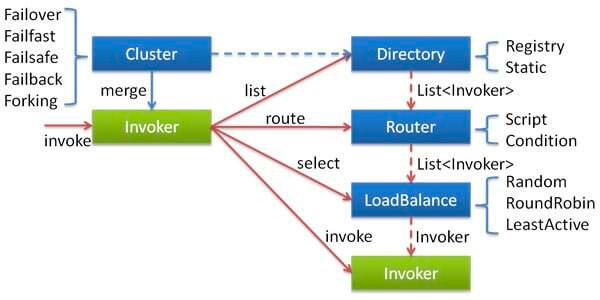

dubbo-cluster集群模块：将多个服务提供方伪装为一个提供方，包括：
负载均衡，集群容错，路由，分组聚合等。集群的地址列表可以是静态配置的，
也可以是由注册中心下发。

容错
- org.apache.dubbo.rpc.cluster.Cluster接口+org.apache.dubbo.rpc.cluster.support包。
- Cluster将Directory中的多个Invoker伪装成一个Invoker，对上层透明，伪装过程包含了容错逻辑，调用失败后重试另一个。

目录
- org.apache.dubbo.rpc.cluster.Directory接口+org.apache.dubbo.rpc.cluster.directory包。
- Directory代表了多个Invoker，可以把它看成List，但是与List不同的是，她的值可能是动态变化的，比如注册中心推送更新。

路由
- org.apache.dubbo.rpc.cluster.Router接口+org.apache.dubbo.rpc.cluster.routerbao。
- 负责从多个Invoker中按路由规则选出子集，比如读写分离，应用隔离等。

配置
- org.apache.dubbo.rpc.cluster.Configurator接口+org.apache.dubbo.rpc.cluster.configurator包。

负载均衡
- org.apache.dubbo.rpc.cluster.LoadBalance接口+org.apache.dubbo.rpc.cluster.loadbalance包。
- LoadBalance负责从多个Invoker中选出具体的一个用于调用，选的过程包含了负载均衡算法，调用失败后需要重选。

合并结果
- org.apache.dubbo.rpc.cluster.Merger接口+org.apache.dubbo.rpc.cluster.merger包。
- 合并返回结果，用于分组聚合。

整合过程如下：

